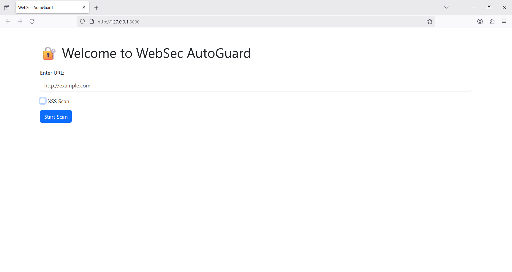
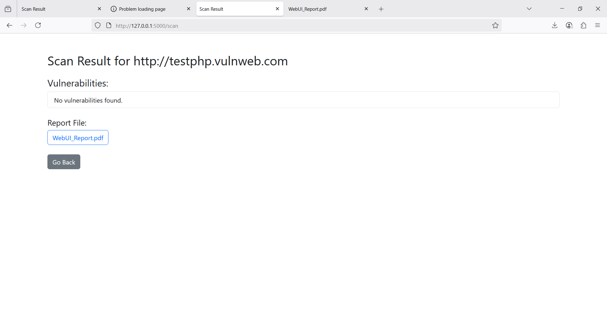
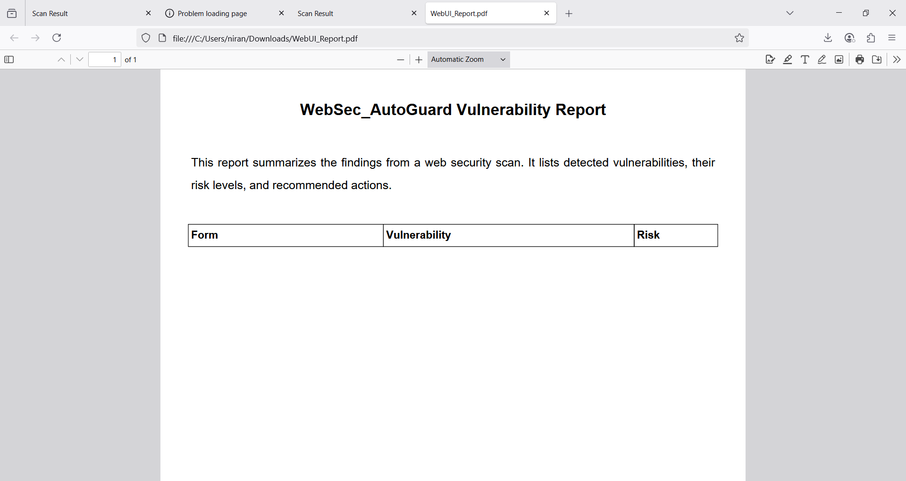

# WebSec_AutoGuard

WebSec_AutoGuard is a Python-based web vulnerability scanner that detects common web security flaws like XSS,
missing headers, insecure HTTP, CSRF tokens, and input length risks.
It supports both CLI and a user-friendly Flask-based web dashboard.
## Features
-  XSS vulnerability detection
-  Insecure HTTP warnings
-  Missing security header checks:
  - X-Content-Type-Options
  - X-Frame-Options
- Content-Security-Policy
-  Static or missing CSRF token detection
-  Long/unbounded input field detection
-  Multithreaded scanning (for speed)
-  Flask dashboard for easy interaction
-  Report generation: PDF & JSON
##  Folder Structure
WebSec\_AutoGuard/
├── scanner.py
├── form\_parser.py
├── vulnerability\_detector.py
├── report\_generator.py
├── utils.py
├── main.py
├── app.py or Dashboard.py
├── templates/
│   └── index.html
├── config.json
├── WebSec\_AutoGuard\_Report.pdf
├── findings.json
├── websec\_autoguard.log
├── README.md
├── requirements.txt
├── demo.mp4
└── .gitignore

##  Installation

git clone https://github.com/Anaj-narinV/Websec_AutoGuard.git
cd Websec_AutoGuard
pip install -r requirements.txt

##  CLI Usage

python main.py --url http://testphp.vulnweb.com --scan-xss --output WebSec_Report.pdf
OR
python main.py --config config.json

##Web UI Dashboard
python app.py
Open browser and go to `http://127.0.0.1:5000`

* Input URL
* Select scan options
* View scan status/results
* Download the PDF report

##  Screenshots

###  Dashboard Preview

### Scan Result

### Report example

##  Demo Video

[ Watch Demo Video](./demo.mp4)

##  Requirements

* Python 3.8+
* Flask
* requests
* bs4
* fpdf

Install with:

pip install -r requirements.txt

## License

This project is licensed under the [MIT License](https://opensource.org/licenses/MIT).

## Author

Niranjana 
GitHub: [Anaj-narinV](https://github.com/Anaj-narinV)

## Future Enhancements

* Add SQLi detection
* Deploy on cloud server
* More detailed reports
* User authentication for dashboard access

